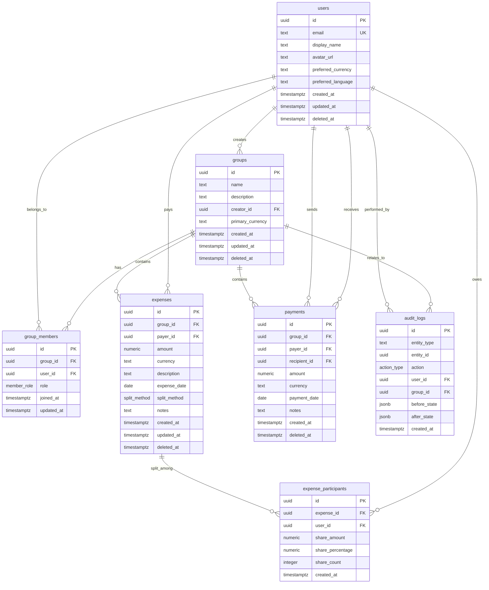

# Database Schema Overview

## Architecture

The Grex expense splitting application uses a PostgreSQL database hosted on Supabase. The schema is designed with the following principles:

- **Data Integrity**: Foreign keys, constraints, and triggers ensure consistency
- **Security**: Row Level Security (RLS) policies restrict data access based on user permissions
- **Performance**: Strategic indexes optimize common query patterns
- **Auditability**: Comprehensive audit logging tracks all changes
- **Real-time**: Publications enable instant updates across devices
- **Scalability**: Efficient schema design supports growth

## Entity Relationship Diagram



## Database Structure

```
PostgreSQL (Supabase)
├── Tables (7)
│   ├── users
│   ├── groups
│   ├── group_members
│   ├── expenses
│   ├── expense_participants
│   ├── payments
│   └── audit_logs
├── Enum Types (3)
│   ├── member_role
│   ├── split_method
│   └── action_type
├── Functions (6+)
│   ├── calculate_group_balances()
│   ├── validate_expense_split()
│   ├── generate_settlement_plan()
│   ├── check_user_permission()
│   ├── validate_currency_code()
│   └── soft_delete_*()
├── Triggers (4+)
│   ├── set_timestamps
│   ├── audit_expense_changes
│   ├── audit_payment_changes
│   └── audit_membership_changes
└── RLS Policies (33)
    ├── users_* (3 policies)
    ├── groups_* (4 policies)
    ├── group_members_* (4 policies)
    ├── expenses_* (4 policies)
    ├── expense_participants_* (4 policies)
    ├── payments_* (3 policies)
    └── audit_logs_* (1 policy)
```

## Core Concepts

### Multi-tenant Architecture
- **Groups** serve as the primary tenant boundary
- Complete data isolation between different groups
- Users can belong to multiple groups with different roles

### Role-based Access Control
```
administrator (Full Access)
    ↓
editor (Create/Modify)
    ↓  
viewer (Read Only)
    ↓
non-member (No Access)
```

### Data Flow
1. **User Registration**: Creates user profile
2. **Group Creation**: User creates or joins groups
3. **Expense Management**: Users add expenses and split costs
4. **Settlement**: System calculates balances and suggests payments
5. **Payment Recording**: Users record debt settlements
6. **Audit Trail**: All actions are logged for accountability

## Key Features

### Security
- **Row Level Security**: Database-level access control
- **Role-based Permissions**: Hierarchical permission system
- **Audit Logging**: Complete modification history
- **Data Isolation**: Groups cannot access each other's data

### Performance
- **Strategic Indexing**: Optimized for common query patterns
- **Efficient Functions**: Business logic executed in database
- **Query Optimization**: Designed for scalability
- **Connection Pooling**: Supabase handles connection management

### Real-time
- **WebSocket Updates**: Instant synchronization across devices
- **RLS-filtered Events**: Users only receive authorized updates
- **Collaborative Features**: Multiple users can work simultaneously

### Data Integrity
- **Foreign Key Constraints**: Maintain referential integrity
- **Check Constraints**: Validate data ranges and formats
- **Triggers**: Automatic timestamp and audit management
- **Soft Delete**: Recoverable deletion with integrity preservation

## Migration Strategy

The schema is managed through versioned migrations:
- Sequential numbering (00001, 00002, etc.)
- Atomic transactions for each migration
- Rollback capability for failed migrations
- Schema integrity verification

## Next Steps

- [Detailed Tables Documentation](tables.md)
- [Relationships and Constraints](relationships.md)
- [Index Strategy](indexes.md)
- [Functions Overview](../functions/overview.md)
- [Security Policies](../security/overview.md)