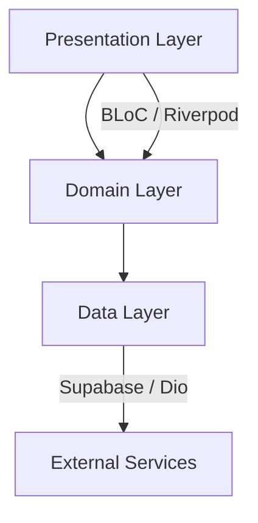
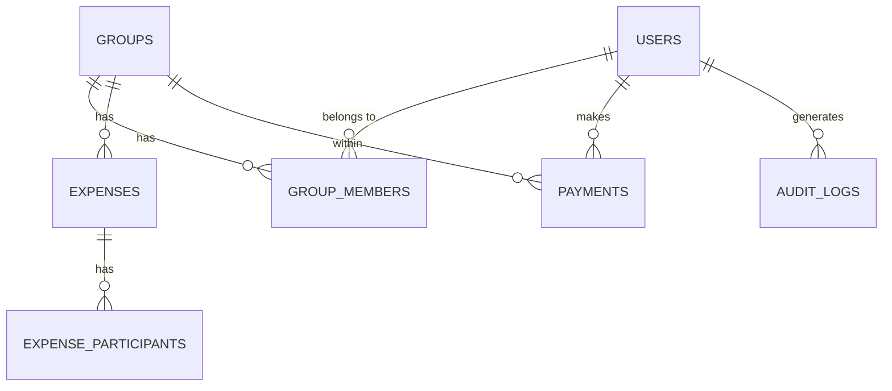

# 📊 Báo Cáo Tình Hình Dự Án Grex

> **Ngày lập:** 14/02/2026  
> **Phiên bản:** 0.0.1+1  
> **SDK:** Dart ^3.8.0 / Flutter  
> **License:** MIT

---

## 1. Tổng Quan Dự Án

**Grex** là ứng dụng chia sẻ chi phí (expense sharing) được xây dựng bằng **Flutter** theo kiến trúc **Clean Architecture**, hỗ trợ đa nền tảng (Android, iOS, Web, Linux, macOS, Windows). Backend sử dụng **Supabase** (PostgreSQL + Auth + Real-time).

### Các Mốc Quan Trọng

| Mốc | Ngày | Ghi chú |
|------|------|---------|
| Initial commit | 2025 | Khởi tạo dự án |
| v0.0.1 | 26/12/2025 | Phiên bản đầu tiên — cấu trúc dự án, tích hợp Supabase, CI/CD, i18n |
| Hiện tại | 14/02/2026 | Đang phát triển tính năng Authentication trên nhánh `authentication` |

---

## 2. Thống Kê Codebase

### Tổng Quan Số Liệu

| Hạng mục | Số lượng |
|----------|----------|
| **Tệp Dart (source)** | 252 |
| **Dòng code (source)** | 41,308 LOC |
| **Tệp Dart (test)** | 114 |
| **Dòng code (test)** | 44,236 LOC |
| **Tệp SQL (migrations)** | 23 |
| **Dòng SQL** | 12,909 LOC |
| **Tệp tài liệu** | 71 |
| **Tổng commits** | 12 |
| **Nhánh** | 3 (`main`, `authentication`, `backend`) |

> [!TIP]
> Tỉ lệ test/source = **1.07x** — số dòng test lớn hơn source code, cho thấy độ phủ test rất tốt.

---

## 3. Kiến Trúc Hệ Thống

### 3.1 Clean Architecture — 3 Layers

### 3.2 Core Infrastructure (14 modules)

| Module | Số tệp | Chức năng |
|--------|---------|-----------|
| `config` | 3 | Quản lý cấu hình (env, app, supabase) |
| `constants` | 2 | Hằng số API & app |
| `di` | 3 | Dependency injection (Riverpod + GetIt) |
| `errors` | 4 | Xử lý lỗi (exceptions, failures, mappers) |
| `feature_flags` | 1 | Quản lý feature flags |
| `localization` | 3 | i18n (Vietnamese & English) |
| `logging` | 5 | Logging service & providers |
| `network` | 7 | Dio HTTP client + 5 interceptors |
| `performance` | 9 | Firebase Performance monitoring + mixins |
| `routing` | 8 | GoRouter + navigation extensions |
| `services` | 6 | Real-time, export, offline queue, error logging |
| `storage` | 9 | Secure & shared storage + migration |
| `utils` | 11 | Utilities (date formatter, validators, etc.) |
| `widgets` | 2 | Widgets dùng chung (error display) |

---

## 4. Feature Modules

### 4.1 Tổng Quan

| Feature | Tệp source | Tệp test | Trạng thái |
|---------|------------|-----------|------------|
| **auth** | 53 | 36 | ✅ Đang phát triển tích cực |
| **balances** | 22 | 7 | ✅ Triển khai |
| **expenses** | 30 | 14 | ✅ Triển khai |
| **export** | 3 | 4 | ✅ Triển khai |
| **feature_flags** | 10 | 8 | ✅ Triển khai |
| **groups** | 21 | 9 | ✅ Triển khai |
| **payments** | 17 | 7 | ✅ Triển khai |

### 4.2 Chi Tiết Feature Chính

- **Auth (53 tệp):** Đăng nhập, đăng ký, quên mật khẩu, quản lý profile, xác minh email, quản lý session — BLoC pattern, property-based tests
- **Expenses (30 tệp):** CRUD chi phí, chia bill, chi tiết expense, danh sách expense
- **Groups (21 tệp):** Tạo/quản lý nhóm, thành viên nhóm
- **Balances (22 tệp):** Tính toán số dư, kế hoạch thanh toán (settlement)
- **Payments (17 tệp):** Ghi nhận thanh toán giữa các thành viên
- **Export (3 tệp):** Xuất dữ liệu chia sẻ qua file

---

## 5. Backend — Supabase

### 5.1 Database Schema (23 migrations)

### 5.2 Danh Sách Migrations

| # | Migration | Mô tả |
|---|-----------|--------|
| 01 | Enum types | Các kiểu enum cơ sở |
| 02 | Users table | Bảng người dùng |
| 03 | Groups table | Bảng nhóm |
| 04 | Group members | Bảng thành viên nhóm |
| 05 | Expenses table | Bảng chi phí |
| 06 | Expense participants | Bảng người tham gia chi phí |
| 07 | Payments table | Bảng thanh toán |
| 08 | Audit logs | Nhật ký kiểm toán |
| 09 | Database functions | Hàm database |
| 10 | Database triggers | Triggers tự động |
| 11 | Row Level Security | Bảo mật RLS |
| 12 | Realtime publications | Cấu hình real-time |
| 13-23 | Fixes & optimizations | Currency validation, soft delete, migration management, RLS fixes, auto user profile |

### 5.3 Backend Testing
- **41 tệp test SQL** trong `supabase/tests/`
- Dữ liệu mẫu staging: [sample_data_staging.sql](file:///c:/Users/koniz/Documents/workspace/koniz-dev/grex/supabase/sample_data_staging.sql)

---

## 6. CI/CD & DevOps

### 6.1 GitHub Actions Workflows

| Workflow | Mô tả |
|----------|--------|
| [ci.yml](file:///c:/Users/koniz/Documents/workspace/koniz-dev/grex/.github/workflows/ci.yml) | CI tổng hợp |
| [test.yml](file:///c:/Users/koniz/Documents/workspace/koniz-dev/grex/.github/workflows/test.yml) | Chạy test suite |
| [coverage.yml](file:///c:/Users/koniz/Documents/workspace/koniz-dev/grex/.github/workflows/coverage.yml) | Báo cáo coverage (Codecov) |
| [deploy-android.yml](file:///c:/Users/koniz/Documents/workspace/koniz-dev/grex/.github/workflows/deploy-android.yml) | Deploy Android |
| [deploy-ios.yml](file:///c:/Users/koniz/Documents/workspace/koniz-dev/grex/.github/workflows/deploy-ios.yml) | Deploy iOS |
| [deploy-web.yml](file:///c:/Users/koniz/Documents/workspace/koniz-dev/grex/.github/workflows/deploy-web.yml) | Deploy Web |

### 6.2 Công Cụ Khác
- **Fastlane** — Tự động hóa deploy iOS/Android
- **Codecov** — Theo dõi code coverage
- **Scripts** — 95 tệp script hỗ trợ (Linux + Windows) cho development, deployment, monitoring, validation

---

## 7. Testing

### 7.1 Phân Bổ Test

| Khu vực | Tệp test | Bao gồm |
|---------|----------|----------|
| Core (routing, services, widgets) | 15 | Router, navigation, real-time, export |
| Auth feature | 36 | BLoC, repositories, validators, integration, widgets, property tests |
| Balances | 7 | BLoC, repository, property tests |
| Expenses | 14 | BLoC, models, repository, property tests |
| Export | 4 | Service property tests |
| Feature Flags | 8 | Manager, provider tests |
| Groups | 9 | BLoC, repository, property tests |
| Payments | 7 | BLoC, repository, property tests |
| Integration tests | 6 | Balance settlement, expense payment, group management, realtime/offline |
| Helpers & shared | 9 | Test utilities, l10n, infrastructure |

### 7.2 Phương Pháp Test
- **Unit Tests** — Mocktail & Mockito cho domain/data layers
- **Property-Based Tests** — Kiểm tra tính chất bất biến
- **Widget Tests** — Kiểm tra UI components
- **Integration Tests** — 6 kịch bản end-to-end (balance settlement, expense payment, group management, realtime/offline)
- **BLoC Tests** — Sử dụng `bloc_test` package

---

## 8. Trạng Thái Git

### 8.1 Nhánh Hiện Tại

| Nhánh | Trạng thái |
|-------|-----------|
| `main` | Nhánh chính — phiên bản v0.0.1 ổn định |
| `authentication` ⬅️ HEAD | **Đang phát triển** — tính năng xác thực |
| `backend` | Hạ tầng backend Supabase |

### 8.2 Working Directory
- **Sạch** — chỉ có 1 untracked file: `devtools_options.yaml`
- HEAD đang ở nhánh `authentication`

---

## 9. Dependencies

### 9.1 Production Dependencies (18 packages)

| Nhóm | Packages |
|------|----------|
| **UI** | `cupertino_icons`, `flutter` |
| **State** | `flutter_bloc`, `flutter_riverpod` |
| **Network** | `dio` |
| **Backend** | `supabase_flutter` |
| **Firebase** | `firebase_core`, `firebase_performance`, `firebase_remote_config` |
| **Storage** | `flutter_secure_storage`, `shared_preferences` |
| **Routing** | `go_router` |
| **i18n** | `flutter_localizations`, `intl` |
| **Code Gen** | `freezed_annotation`, `json_annotation` |
| **Utility** | `dartz`, `equatable`, `get_it`, `logger`, `path`, `path_provider`, `share_plus`, `flutter_dotenv` |

### 9.2 Dev Dependencies (10 packages)

`bloc_test`, `build_runner`, `flutter_launcher_icons`, `flutter_test`, `freezed`, `integration_test`, `json_serializable`, `mockito`, `mocktail`, `very_good_analysis`

---

## 10. Tài Liệu Dự Án

Dự án có **71 tệp tài liệu** trong thư mục `docs/`, bao gồm:

| Thư mục | Số tệp | Nội dung |
|---------|--------|----------|
| `architecture/` | 3 | Overview, design decisions |
| `api/` | 12 | API docs & examples |
| `database/` | 14 | Schema, migrations, security |
| `deployment/` | 9 | Deploy guides (Android, iOS, Web) |
| `features/` | 2 | Feature flags, tasks |
| `guides/` | 30 | Getting started, routing, i18n, migration guides |

Ngoài ra: [README.md](file:///c:/Users/koniz/Documents/workspace/koniz-dev/grex/README.md), [CONTRIBUTING.md](file:///c:/Users/koniz/Documents/workspace/koniz-dev/grex/CONTRIBUTING.md), [CHANGELOG.md](file:///c:/Users/koniz/Documents/workspace/koniz-dev/grex/CHANGELOG.md)

---

## 11. Đánh Giá & Khuyến Nghị

### ✅ Điểm Mạnh
- **Kiến trúc tốt** — Clean Architecture rõ ràng, phân tách layers nghiêm ngặt
- **Tỉ lệ test cao** — 44K LOC test > 41K LOC source (tỉ lệ 1.07x)
- **Backend vững chắc** — 23 migrations với RLS, triggers, audit logs, soft delete
- **CI/CD đầy đủ** — 6 workflows cho test, coverage, deploy 3 nền tảng
- **Tài liệu phong phú** — 71 tệp docs, migration guides, API docs
- **Hỗ trợ đa nền tảng** — 6 platforms (Android, iOS, Web, Linux, macOS, Windows)

### ⚠️ Lưu Ý
- Phiên bản vẫn ở **0.0.1+1** — chưa có bản release chính thức
- Số commit ít (**12 commits**) — dự án đang ở giai đoạn đầu
- Nhánh `authentication` đang active — cần hoàn thiện và merge
- Nhiều dependencies bị loại bỏ (commented-out) — cần dọn dẹp khi ổn định

### 📋 Bước Tiếp Theo Đề Xuất
1. Hoàn thiện tính năng **Authentication** trên nhánh `authentication` và merge vào `main`
2. Merge nhánh `backend` vào `main` nếu đã ổn định
3. Chạy full test suite và đảm bảo coverage mục tiêu
4. Chuẩn bị phiên bản **v0.1.0** với các tính năng cốt lõi hoàn chỉnh
5. Kiểm tra và cấu hình CI/CD triggers (hiện đang disabled theo README)
